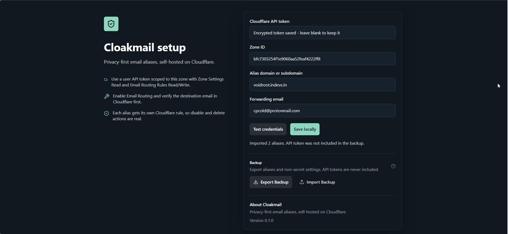
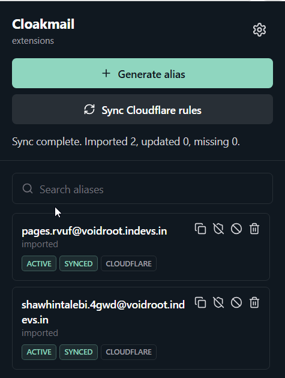
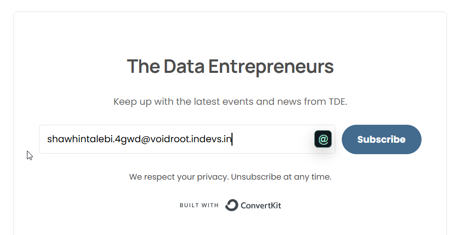
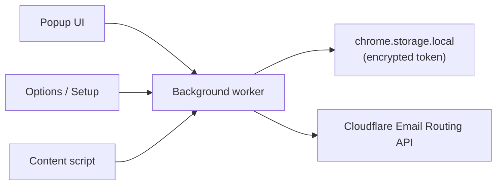

# Cloakmail — Privacy-first email aliases, self-hosted on Cloudflare

> Your inbox, your rules. Generate unique email aliases using your own domain and Cloudflare account.

No central servers. No tracking. No subscriptions. Every alias gets its own Cloudflare Email Routing rule — disable, block, or delete it and mail stops immediately.

---

## Features

- 🔒 **No central servers** — runs entirely in your browser
- ⚡ **Dedicated routing rules** — one real Cloudflare rule per alias, not catch-all
- 🗑️ **Full alias control** — disable, block (drop), or permanently delete from Cloudflare
- 🧩 **Autofill** — detects email fields and injects a one-click alias button
- 🔑 **Encrypted token storage** — API token encrypted with AES-GCM via SubtleCrypto
- 🔄 **Cloudflare sync** — verify local state matches live Cloudflare rules
- 📋 **Copy on generate** — alias goes straight to your clipboard
- 🌙 **Dark mode** — respects system preference

---

## Screenshots

| Setup Wizard | Popup | Autofill Button |
|---|---|---|
|  |  |  |


---

## How It Works

```
Visit github.com → Click extension → "Generate Alias"

github.x82s@mail.example.com  ──►  you@gmail.com
         ▲                               ▲
  Cloudflare routing rule         Your real inbox
  (created instantly via API)
```

Each alias is a real Cloudflare Email Routing rule scoped to one address. Disabling turns the rule off. Blocking converts it to a `drop` action. Deleting removes the rule from Cloudflare entirely — mail bounces immediately, no catch-all fallback.



---

## Requirements

- Chrome, Brave, or Edge (Firefox planned)
- A Cloudflare account
- A domain or subdomain managed by Cloudflare
- Cloudflare Email Routing enabled on that zone
- A **verified** destination address in Cloudflare Email Routing
- Node.js ≥ 18 if building from source

---

## Installation

### From Source (Developer Mode)

```bash
git clone https://github.com/YOUR_USERNAME/cloakmail.git
cd cloakmail
npm install
npm run build
```

The unpacked extension is generated at:

```
build/chrome-mv3-prod/
```

**Load in Chrome / Edge / Brave:**

1. Open `chrome://extensions`
2. Enable **Developer mode** (top right)
3. Click **Load unpacked**
4. Select `build/chrome-mv3-prod`
5. Pin Cloakmail to your toolbar

### Package a zip

```bash
npm run package
# → build/chrome-mv3-prod.zip
```

---

## Cloudflare Setup

### 1. Enable Email Routing

1. Open your domain in the Cloudflare dashboard
2. Go to **Email → Email Routing**
3. Click **Enable Email Routing** and add the required DNS records
4. Under **Destination addresses**, add and verify your real inbox (e.g. `you@gmail.com`)

> ⚠️ Your destination address **must be verified** before any routing rules will work. Cloudflare sends a verification email — click the link in it.

### 2. Create a Scoped API Token

1. Go to **My Profile → API Tokens → Create Token → Custom token**
2. Set the zone scope to your specific domain
3. Add these permissions:

| Resource | Permission |
|---|---|
| Zone | Read |
| Zone Settings | Read |
| Email Routing Rules | Read |
| Email Routing Rules | Edit |

> Do **not** use the Global API Key. A narrowly scoped token is safer and limits blast radius if exposed.

### 3. Find Your Zone ID

1. Open your domain in Cloudflare
2. Zone ID is in the **Overview** sidebar (right side)
3. Copy it — you'll paste it into Cloakmail settings

### 4. Configure Cloakmail

1. Click the Cloakmail icon → **Open Settings** (or it opens automatically on install)
2. Complete the setup wizard:
   - Paste your **API token**
   - Paste your **Zone ID**
   - Enter your **alias domain** (e.g. `mail.example.com`)
   - Enter your **forwarding email** (e.g. `you@gmail.com`)
3. Click **Test credentials** — all checks should go green
4. Click **Save & finish**

> 💡 Do **not** enable catch-all on your alias subdomain. Cloakmail uses dedicated per-alias rules, so deleted aliases should bounce, not forward.

---

## Usage

### Generate an Alias

1. Visit any website
2. Open the Cloakmail popup
3. Click **Generate alias**
4. Alias is auto-copied to your clipboard

```
github.com  →  github.x82s@mail.example.com
amazon.com  →  amazon.k29s@mail.example.com
```

### Autofill Signup Forms

Cloakmail detects email input fields on any page and injects a small shield icon. Click it to generate and fill an alias in one step — no popup needed.

### Manage Aliases

Tap any alias in the **Aliases** tab to expand actions:

| Action | What happens in Cloudflare |
|---|---|
| **Disable** | Rule is turned off — mail is silently dropped |
| **Block** | Rule action is changed to `drop` — permanently ignores mail |
| **Delete** | Rule is deleted — mail bounces with a 550 |
| **Enable** | Rule is turned back on |

### Sync with Cloudflare

If you've changed rules manually in the Cloudflare dashboard, click **Sync** in the popup to reconcile local state with live CF rules.

---

## Required Cloudflare Permissions

| Permission | Why |
|---|---|
| Zone → Read | Validate zone and list zones during setup |
| Zone Settings → Read | Check Email Routing is enabled |
| Email Routing Rules → Read | List rules, sync state |
| Email Routing Rules → Edit | Create, disable, block, delete rules |

---

## Security

- API token encrypted at rest using **AES-GCM / SubtleCrypto** — never stored in plaintext
- Token is only accessed in the **background service worker** — content scripts never touch it
- No data leaves your browser except direct calls to `api.cloudflare.com`
- No analytics, no telemetry, no external database
- Minimal permissions: `storage`, `activeTab`, `scripting`, `clipboardWrite`
- Content Security Policy: `script-src 'self'` — no eval, no inline scripts

<!-- See [SECURITY.md](SECURITY.md) for the responsible disclosure policy. -->

---

## FAQ

**Does this work without a custom domain?**
No — you need a domain on Cloudflare with Email Routing enabled. There is no shared infrastructure.

**Can I use multiple domains?**
Not in v1. Multiple domain support is planned for v2.

**Is this affiliated with Cloudflare?**
No. Cloakmail is an independent open-source project that uses the public Cloudflare API.

**What happens to mail sent to a deleted alias?**
It bounces at Cloudflare's MTA (550 No such address). As long as catch-all is not enabled on your alias subdomain, no mail gets through.

**What's the alias limit?**
Cloudflare's free plan supports 200 routing rules. Cloakmail tracks your count and warns you before you hit the limit. Paid Cloudflare plans support up to 1,000.

**Is my API token safe?**
It is encrypted with AES-GCM before being written to `chrome.storage.local`, using a key derived from a per-install ID via PBKDF2. It is never sent anywhere except `api.cloudflare.com`.

**Can I export my aliases?**
Yes — Settings → Export Backup generates a JSON file with all alias metadata. The API token is not included in the export.

---

## Roadmap

- [ ] Firefox support
- [ ] Multiple domain support
- [ ] Temporary / burn-after-use aliases
- [ ] Alias analytics (emails received count via CF log drain)
- [ ] Bulk delete / bulk disable
- [ ] Import aliases from another instance
- [ ] Safari / WebExtensions support
- [ ] Mobile companion app

---

## Contributing

Pull requests are welcome. For large changes, please open an issue first to discuss the approach.

1. Fork the repo
2. Create a feature branch: `git checkout -b feat/my-feature`
3. Commit your changes
4. Open a pull request

<!-- Please read [CONTRIBUTING.md](CONTRIBUTING.md) before submitting. -->


## License

MIT — see [LICENSE](LICENSE) for details.